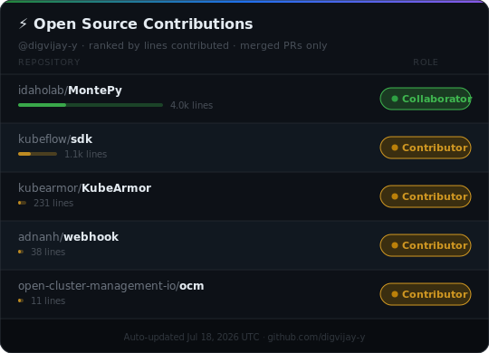

# 👋 Hey there, I'm Digvijay!

🎓 Final year Electronics & Telecommunication Engineering student  
📍 India | Backend/Infra/Scientific Computing

Currently: DevOps Intern at Quant-data.io

**Top 4%** International Quant Championship 2025 by WorldQuant

---

### 🛠 Tech Stack:

- **Languages:** Go · Python · C++
- **Databases:** PostgreSQL · SQL
- **DevOps:** Docker · Kubernetes · Terraform · AWS
---

                     
 

  
### 📈 GitHub Stats

  
  
  
  
  

---

### 🔝 Top Contributed Repo  

### 📬 Let’s Connect

- [LinkedIn](https://linkedin.com/in/digvijay-yeware)  
- [Email](mailto:yewaredigvijay@gmail.com)

> *“Engineer with curiosity, discipline, and caffeine. With love for Mathematics and computer Science”*
